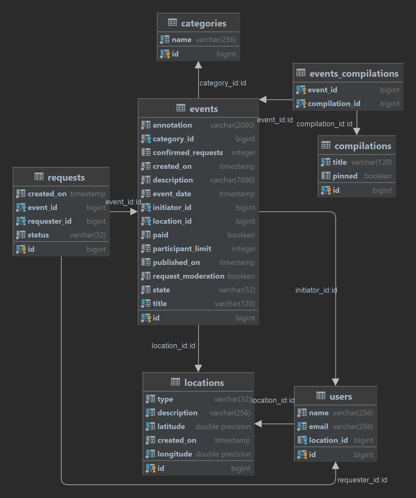
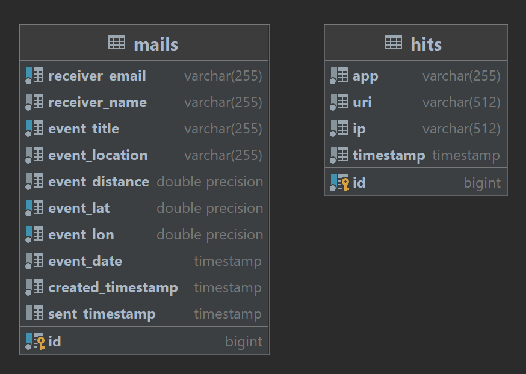

# Explore with me!
Приложение "Explore with me" - это афиша, где можно предложить какое-либо событие - от выставки до похода в кино - и набрать компанию для участия в нём!

## PR #1 (основной функционал):
https://github.com/Sergej-Nishpal/java-explore-with-me/pull/1

## PR #2 (дополнительный функционал):
https://github.com/Sergej-Nishpal/java-explore-with-me/pull/2
___

## Описание функциональности "Локации":
- пользователю предоставлена возможность указать при регистрации данные о своём местоположении/месте жительства;
- в этом случае: после публикации админом события, которое будет происходить в радиусе менее 3-х километров (это опционально) от пользователя, email пользователя передаётся в список рассылки - он получит уведомление об опубликованном событии поблизости от него;
- список рассылки сохраняется на сервере статистики, в отдельной таблице, с отметкой времени отправки уведомления (если отправлено);
- отдельный сервис может забирать неотправленные письма, отправлять их, и помечать отправленными;
- администратор имеет возможность добавлять/изменять/удалять локации;
- если локация привязана к опубликованному событию/событиям, то удаляется она только после смены статуса этого события/событий;
- пользователи (авторизованные или нет) имеют возможность получать списки событий с информацией о расстоянии до мест проведения этих событий в километрах. 

## Внешние тесты:
Insomnia V4 ([impex плагин](https://insomnia.rest/plugins/insomnia-plugin-export-import)): [Insomnia](info/tests/insomnia/Insomnia_2022-12-07.json)

Postman: [Postman](info/tests/postman)

### Диаграммы баз данных

- Main service:
> 

- Stat service:
> 